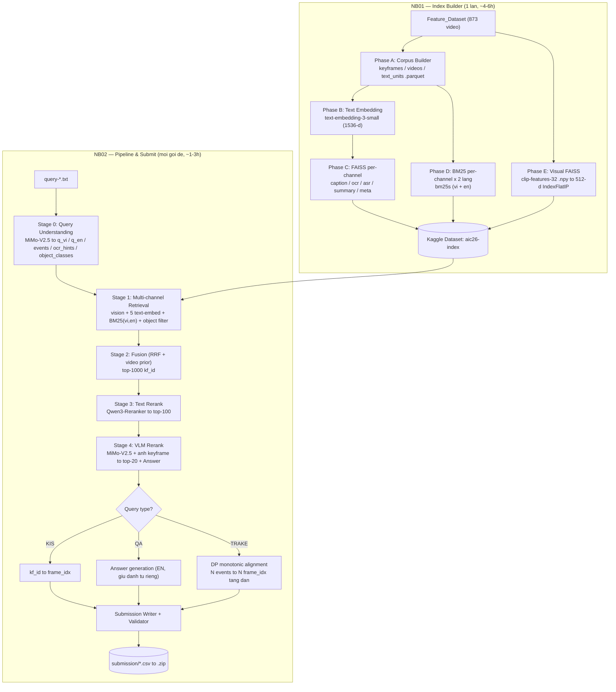

# 00 — MASTER PLAN: Hệ thống Video Retrieval AIC 2026 (Vòng Sơ Tuyển)

## 1. Mục tiêu

Xây dựng pipeline retrieval đa phương thái trên **873 video / 177,321 keyframe** đã trích xuất sẵn features, sinh ra file nộp bài đúng thể lệ cho **3 dạng truy vấn**: `KIS`, `QA`, `TRAKE`.

**Deliverable cuối:** `team_XXX_roundN.zip` chứa thư mục `submission/` với các file `query-*.csv`.

## 2. Ràng buộc cứng (constraints)

| Ràng buộc | Giá trị | Hệ quả thiết kế |
|:--|:--|:--|
| Compute | Kaggle, 2× T4 (16GB VRAM mỗi GPU) | Model local phải ≤ 14GB fp16/1 GPU, hoặc quantize |
| Timeout | 12h cho mỗi lần "Save & Version" | **Bắt buộc tách notebook** + checkpoint resumable |
| Số dòng CSV | ≤ 100 dòng / query | Nộp nhiều hypothesis, không chỉ top-1 |
| Số lần nộp | ≤ 3 lần / gói, **lần cuối được tính** | Giữ lại 1 lần nộp cho bản đã validate kỹ |
| Q&A answer | ≤ 100 ký tự, cách chấm **thể lệ nói mâu thuẫn** | Xem QĐ-5. Thiết kế cho kịch bản xấu nhất = exact-string |
| Đối tượng dự thi | **Sinh viên** (không phải THPT) | Không cần theo hướng dẫn Excel trong thể lệ |

### Coverage gap của dữ liệu — PHẢI xử lý

| Channel | Coverage | Xử lý |
|:--|:--|:--|
| CLIP visual, caption, map-keyframes, media-info, objects, ASR | 873/873 | — |
| **OCR** | **700/873** — thiếu 30 video của L25 + toàn bộ L28/L29/L30 | Video thiếu OCR **không được** bị điểm 0; dùng RRF (rank-based) thay vì cộng điểm thô. Tính `has_ocr` từ `ocr_index.jsonl` thật, **đừng suy ra từ prefix** — chi tiết `05_KAGGLE_PATHS.md §6.3` |
| **Summary** | **865/873** thật — thư mục có 866 `.json` nhưng 1 file là sentinel `_failed.json` | **8** video thiếu: `L26_V072`–`L26_V079`. Fallback dùng `media-info.description`. Mọi vòng lặp phải skip stem bắt đầu bằng `_` |
| Caption `duplicate_of` | ~8.2% keyframe là trùng | Không embed lại; map dup → canonical, nhưng **vẫn giữ `kf_id` riêng** để nộp bài |

## 3. Kiến trúc tổng thể



**Tại sao 2 notebook (không phải 1):** NB01 chạy 1 lần rồi publish thành Kaggle Dataset. Mỗi gói đề mới chỉ cần chạy NB02 (~1-3h), không bao giờ phải build lại index. Điều này là bắt buộc vì BTC phát đề theo nhiều đợt và mỗi đợt có deadline ngắn.

> Nếu NB01 chạm mốc 12h: tách thành `NB01A` (Phase A+D+E, CPU-only, ~1h) và `NB01B` (Phase B+C, API-bound, chain dataset từ NB01A).

## 4. SÁU QUYẾT ĐỊNH KỸ THUẬT (đọc kỹ trước khi code)

### QĐ-1 — ~~OpenRouter KHÔNG có endpoint embeddings~~ → **ĐÃ LỖI THỜI, OpenRouter CÓ**

> ⚠️ **Sửa 2026-08-21.** Tiền đề gốc ("OpenRouter chỉ proxy `/chat/completions`, không có `/v1/embeddings`") **không còn đúng**. Đã verify bằng probe: `POST https://openrouter.ai/api/v1/embeddings` trả **401** (y như `chat/completions` khi thiếu auth), còn path bịa trả HTML 404 → **endpoint tồn tại thật**.
>
> Lưu ý: `GET /api/v1/models` (417 model) **không liệt kê** model embedding nào — nên đừng dùng nó để kết luận là không có. Model page `openrouter.ai/openai/text-embedding-3-small` cũng trả 200.
>
> **Hệ quả tốt:** chỉ cần **1 key duy nhất** (`OPENROUTER_API_KEY`) cho toàn bộ pipeline — embedding + LLM + VLM. Không cần key OpenAI riêng.

**Provider switch trong CONFIG — ba mode:**

| Mode | Endpoint | Model id gửi đi | Khi dùng |
|:--|:--|:--|:--|
| `EMBED_PROVIDER="openrouter"` (**mặc định**) | `https://openrouter.ai/api/v1` + `OPENROUTER_API_KEY` | `openai/text-embedding-3-small` (**có prefix**) | Chỉ có key OpenRouter — trường hợp phổ biến nhất |
| `EMBED_PROVIDER="openai"` | `https://api.openai.com/v1` + `OPENAI_API_KEY` | `text-embedding-3-small` | Có key OpenAI. Chi phí **~$0.26 cho toàn corpus** (xem §6) |
| `EMBED_PROVIDER="local"` | `sentence-transformers` trên T4 | `BAAI/bge-m3` (dim **1024**) | Không có key nào, hoặc smoke test `cos(en,vi) < 0.35` |

Code viết 1 hàm `embed_texts(texts) -> np.ndarray` duy nhất + `embed_endpoint()` trả `(base_url, key, model_id)`. **Đổi provider không được sửa code downstream.**

Header optional cho OpenRouter: `HTTP-Referer` (site URL) và `X-Title` (site name) — chỉ dùng cho bảng xếp hạng openrouter.ai, không bắt buộc.

**`BUILD_MANIFEST.json` ghi tên CANONICAL** (`text-embedding-3-small`, không prefix). Guard ở NB02 so sánh theo tên canonical (`m.split("/")[-1]`) nên **NB01 embed qua OpenAI rồi NB02 embed qua OpenRouter vẫn hợp lệ** — cùng model = cùng không gian vector. Chỉ khác *model* mới phải dừng.

### QĐ-2 — Kênh visual PHẢI dùng CLIP text encoder, KHÔNG dùng text-embedding-3-small

**Vấn đề:** `text-embedding-3-small` và CLIP ViT-B/32 là **hai không gian vector khác nhau**. Keyframe đã embed bằng `clip-ViT-B-32` nên query muốn match ảnh thì phải encode qua **đúng CLIP ViT-B/32 text tower**. Không có cách nào bridge hai space này.

**Quy tắc:**
- `vision.faiss` (512-d) ← query encode bằng `SentenceTransformer('clip-ViT-B-32')`, input = `visual_desc_en` (mô tả cảnh thuần thị giác, tiếng Anh, ≤77 token).
- `text_*.faiss` (1536-d) ← query encode bằng `text-embedding-3-small`, input = `q_en` / `q_vi`.
- Hai kênh này **không bao giờ** so sánh vector trực tiếp với nhau; chỉ hợp nhất ở tầng **rank (RRF)**.

**Nâng cấp tương lai (SigLIP2-giant):** Theo `Kiet-Prompt/Model_Embedding.txt`, thứ tự chất lượng là `siglip2-giant > siglip-so400m > siglip2-base > clip-ViT-B-32`. Muốn đổi thì phải **re-embed cả 177,321 ảnh** (notebook `aic2026-siglip-embedding` ở `Link.txt`) và đổi cả text tower. Thiết kế `VISUAL_MODEL` + `VISUAL_DIM` thành config để swap. Ưu tiên: làm xong end-to-end với CLIP trước, nâng cấp SigLIP2 sau khi có baseline điểm.

### QĐ-3 — Reranker không phải chat model

**Vấn đề:** `qwen/qwen3-reranker-8b` là **cross-encoder** (input = cặp `[query, doc]`, output = 1 scalar), không phải chat model nên không gọi được qua OpenRouter chat completions.

**Giải pháp — 2 mode:**

| `RERANK_MODE` | Cách làm | Ghi chú |
|:--|:--|:--|
| `"local"` (khuyến nghị) | `Qwen/Qwen3-Reranker-4B` fp16 trên 1× T4 (~8GB) | 8B fp16 = 16GB nên **không vừa** T4; muốn 8B phải dùng AWQ/GPTQ 4-bit. Khuyến nghị 4B trước |
| `"openrouter_llm"` | Listwise rerank: prompt MiMo-V2.5 với 20 candidate/lần, yêu cầu trả về thứ tự | Không cần GPU, nhưng chậm + tốn token hơn |

### QĐ-4 — VLM rerank cần ẢNH keyframe THẬT

`Feature_Dataset` **không chứa ảnh JPG**. Ảnh nằm ở dataset `fatle542/aic-dataset` — **115.75 GB** (verify qua API).

- **Pattern đã verify:** `Keyframes_<batch>/keyframes/<video_id>/<nnn>.jpg`, ví dụ `Keyframes_L21/keyframes/L21_V001/001.jpg`. **Không phẳng** như dự đoán ban đầu.
- Tên thư mục batch cho L26 **chưa verify** (có thể `Keyframes_L26_a…e` giống 14 batch ASR) → dùng hàm `build_kf_index()` ở `05_KAGGLE_PATHS.md §4` để quét 1 lần rồi cache, đừng đoán.
- **Chỉ attach vào NB02.** NB01 không cần ảnh (chỉ dùng `.npy`), mà mount 115GB / ~177K file nhỏ thì rất chậm.
- Ảnh gửi VLM phải resize (long side ≤ 768px) + base64 để giảm token.

### QĐ-5 — Ngôn ngữ query & answer

Giữ **cả hai** query như yêu cầu:

| Field | Nguồn | Dùng cho |
|:--|:--|:--|
| `q_vi` | Query gốc BTC | BM25 trên field tiếng Việt: **OCR**, ASR-vi, metadata |
| `q_en` | MiMo-V2.5 rewrite/translate | Embedding text (1536-d), BM25 trên caption/summary/ASR-en |
| `visual_desc_en` | MiMo-V2.5 extract phần thuần thị giác | **Chỉ** cho CLIP visual channel (≤77 token) |

**Answer (Q&A):** mặc định **verbatim tiếng Việt**, tiếng Anh chỉ là dòng hedge phụ.

> **Thể lệ tự mâu thuẫn — phải biết trước.** `TheLeCuocThi/sotuyenAIC.md` nói cả hai: phần đầu ghi *"so sánh chính xác **về mặt ngữ nghĩa**"*, nhưng mục "Lưu ý quan trọng" lại ghi *"Answer (Q&A) sẽ được so sánh dưới dạng **chuỗi chính xác**"*. Không biết BTC dùng vế nào → **thiết kế cho vế khắt khe hơn (exact-string)**, vì bản verbatim tiếng Việt vẫn đúng dưới cách chấm ngữ nghĩa, còn bản dịch tiếng Anh thì sai dưới exact-string.

> **Dữ kiện quyết định:** cả **3/3** query QA trong bộ đề thật đều là dạng *đọc chữ hiện trên màn hình*, đáp án là tiếng Việt nguyên văn — `p1-15` (tên xã ở Khánh Hòa), `p1-19` (2 câu thơ), `p1-22` (tiêu đề công thức món ăn). Không có query nào thuộc dạng đếm/màu sắc. Nghĩa là nhánh "trả lời tiếng Anh" áp dụng cho **0/3** ca quan sát được.

> **Danh từ riêng KHÔNG được dịch.** Ví dụ `query-p1-15-qa` hỏi tên xã ở Khánh Hòa — đáp án phải là tên xã gốc tiếng Việt, dịch sang tiếng Anh là sai. Tương tự: tên người, địa danh, tên tổ chức, và **câu thơ** (`query-p1-19-qa` hỏi 2 câu thơ ca ngợi Nguyễn Trung Trực nên phải trả nguyên văn tiếng Việt).
>
> **Quy tắc trong prompt VLM:** mặc định **verbatim tiếng Việt đúng như hiện trên màn hình / đúng như người nói** — danh từ riêng, trích dẫn, thơ, tên riêng, tiêu đề. Chỉ dùng English khi câu hỏi thuần mô tả/số lượng/màu sắc **và** không có chuỗi tiếng Việt tương ứng trên khung hình.
>
> **Hedge bằng số dòng:** được 100 dòng thì không phải chọn một. Nộp answer tiếng Việt ở các dòng đầu, rồi lặp lại cùng frame với biến thể tiếng Anh ở các dòng sau. Dưới cách chấm ngữ nghĩa cả hai đều trúng; dưới exact-string thì ít nhất bản tiếng Việt còn cơ hội.

### QĐ-6 — TRAKE cần thuật toán riêng, không phải retrieval thường

TRAKE yêu cầu N frame_idx **cùng 1 video**, **thứ tự thời gian tăng dần**, khớp N event. Retrieval top-K thông thường sẽ trả về frame rải rác nhiều video nên sai format.

Bắt buộc: **video-level retrieval trước, rồi DP monotonic alignment trong video**. Chi tiết thuật toán ở `03_NB02_PIPELINE_SUBMIT.md §6.3`.

## 5. CONFIG block chuẩn (copy vào cell đầu MỌI notebook)

```python
# ============================================================
#  CONFIG - user tu dien API key, KHONG commit key vao git
# ============================================================
OPENROUTER_API_KEY = ""   # MiMo-V2.5 (query rewrite, VLM rerank, QA answer)
OPENAI_API_KEY     = ""   # text-embedding-3-small  (xem QD-1)

# ---- Text embedding (QD-1) ----
EMBED_PROVIDER    = "openai"                  # "openai" | "local"
EMBED_MODEL       = "text-embedding-3-small"
EMBED_DIM         = 1536
EMBED_BASE_URL    = "https://api.openai.com/v1"
LOCAL_EMBED_MODEL = "BAAI/bge-m3"             # dung khi EMBED_PROVIDER="local" (dim=1024)
EMBED_BATCH       = 256
EMBED_MAX_RETRY   = 6
EMBED_CONCURRENCY = 8

# ---- Visual embedding (QD-2) - PHAI khop model da embed keyframes ----
VISUAL_MODEL = "clip-ViT-B-32"                # tuong lai: "google/siglip2-giant-opt-patch16-384"
VISUAL_DIM   = 512

# ---- LLM / VLM qua OpenRouter ----
OPENROUTER_BASE_URL = "https://openrouter.ai/api/v1"
LLM_MODEL = "xiaomi/mimo-v2.5"                # query understanding
VLM_MODEL = "xiaomi/mimo-v2.5"                # final rerank + QA answer
VLM_IMAGE_MAX_SIDE = 768

# ---- Reranker (QD-3) ----
RERANK_MODE        = "local"                   # "local" | "openrouter_llm"
RERANK_MODEL_LOCAL = "Qwen/Qwen3-Reranker-4B"

# ---- Retrieval / Fusion ----
TOPK_PER_CHANNEL = 500
TOPK_FUSED       = 1000
TOPK_TEXT_RERANK = 100
TOPK_VLM_RERANK  = 20
RRF_K            = 60
MAX_ROWS_PER_CSV = 100

CHANNEL_WEIGHTS = {          # tune tren bo de thu (kitnehi1211/dethithunghiem)
    "vision": 1.00, "caption": 0.90, "ocr": 0.70,
    "asr": 0.60, "summary_prior": 0.50, "meta_prior": 0.35,
    "bm25_ocr_vi": 0.80, "bm25_caption_en": 0.50,
    "bm25_asr_vi": 0.55, "bm25_meta": 0.40,
    "object_bonus": 0.30,
}

# ---- Paths ----
# KHONG dinh nghia o day. Copy PATHS block + resolve() tu Planning/05_KAGGLE_PATHS.md §2-3
# (da verify qua Kaggle API 2026-08-20). Tom tat:
#   FEAT_ROOT   = /kaggle/input/datasets/kitnehi1211/feature-aic-2026/Feature_Dataset
#   QUERY_ROOT  = /kaggle/input/datasets/kitnehi1211/dethithunghiem
#   KEYFRAME_DS = /kaggle/input/datasets/fatle542/aic-dataset
#   INDEX_ROOT  = /kaggle/input/datasets/kitnehi1211/aic26-index
WORK = "/kaggle/working"
```

> **Path đã được verify thật** qua Kaggle API — xem [`05_KAGGLE_PATHS.md`](./05_KAGGLE_PATHS.md). Ba điều bất ngờ đã xác nhận: (1) Feature dataset có **thêm 1 lớp `Feature_Dataset/`** bên trong; (2) mount theo dạng **owner-qualified** `/kaggle/input/datasets/<owner>/<slug>`; (3) ảnh keyframe theo pattern `Keyframes_<batch>/keyframes/<video_id>/<nnn>.jpg`, **không phẳng**.

## 6. Ước lượng chi phí & thời gian (dựa trên số liệu thật đã đo)

**Số liệu thật đã kiểm tra:** 873 video · 177,321 keyframe · 128,664 dòng OCR · ~50 ASR segment/video · caption trung bình 33 từ (~45 token) · 8.2% caption là duplicate.

| Channel | Số unit embed | ~Token | Ghi chú |
|:--|--:|--:|:--|
| caption | ~163,000 | ~7.3M | 177,321 trừ 8.2% dup |
| ocr (1 unit / keyframe) | **128,664** | ~2.5M | `ocr_index.jsonl` **đã là 1 dòng/keyframe** — không gộp gì cả (đã verify: 128,664 dòng = 128,664 cặp `(video_id, keyframe)` unique) |
| asr (window 25s / stride 10s, **đã dedupe**) | ~21,500 | ~1.9M | dùng `text_en`. Trước dedupe ~35,000 — xem `01_DATA_CONTRACTS.md §3.2` |
| summary (video + chunk) | ~5,200 | ~1.0M | |
| meta | 873 | ~0.2M | |
| **TỔNG** | **~319,000** | **~13M** | |

- **Chi phí embedding:** ~13M token × $0.02/1M = **≈ $0.26** (một lần duy nhất).
- **Thời gian NB01:** batch 256 nên ~1,250 request. Với 8 luồng song song ≈ **1.5–3h** (chủ yếu I/O). Phase A/D/E ~1h. Tổng **~3–4h, an toàn dưới 12h**.
- **Dung lượng index:** text 319K × 1536 × 4B ≈ **2.0 GB** (fp32 cho FAISS; fp16 = 0.9GB). Visual 177K × 512 × 4B ≈ **363 MB**. BM25 ~300MB. Dataset output **~2.7 GB**, OK.
- **Chi phí NB02 / gói 24 query:** query understanding 24 call + VLM rerank 24 × 20 ảnh = 480 call VLM + reranker local. Khoảng **$1–3/gói** tùy giá MiMo.

## 7. Risk register

| # | Rủi ro | Xác suất | Tác động | Mitigation |
|:-:|:--|:-:|:-:|:--|
| R1 | ~~`xiaomi/mimo-v2.5` không tồn tại / không có vision trên OpenRouter~~ | ✅ **ĐÓNG** | — | **Đã verify 2026-08-21:** model có thật, `input_modalities = ["text","audio","image","video"]`. ⚠️ Bản `xiaomi/mimo-v2.5-pro` là **text-only** — đừng đổi sang. Fallback đã xác nhận: `qwen/qwen3-vl-*` (7 bản), `google/gemini-2.5-flash(-lite)` |
| R2 | Đường dẫn ảnh keyframe khác kỳ vọng (QĐ-4) | Cao | Chặn Stage 4 | Cell verify path + `glob` tự dò trước khi chạy |
| R3 | NB01 vượt 12h | Trung bình | Mất toàn bộ session | Checkpoint mỗi 50 batch ra `WORK/ckpt/`; tách NB01A/NB01B |
| R4 | Rate limit / 429 khi embed | Trung bình | Chậm | Exponential backoff + jitter, `EMBED_MAX_RETRY=6`, concurrency ≤ 8 |
| R5 | 173 video thiếu OCR làm lệch điểm fusion | Trung bình | Giảm recall | Dùng **RRF (rank-based)**, không cộng score thô; normalize theo số channel khả dụng |
| R6 | Q&A dịch sai danh từ riêng (QĐ-5) | **Cao** | Sai đáp án | Prompt constraint bắt buộc verbatim + review tay trước khi nộp |
| R7 | TRAKE sai số lượng frame | Trung bình | 0 điểm câu đó | Validator hard-check `len(frames) == n_events` |
| R8 | Qwen3-Reranker-8B OOM trên T4 | Cao nếu chọn 8B | Chặn Stage 3 | Mặc định 4B; hoặc AWQ 4-bit |
| R9 | Hết 3 lần nộp mà chưa có bản tốt | Trung bình | Mất điểm | Nộp lần 1 = baseline an toàn đã validate; lần 2–3 mới thử cải tiến |

## 8. Nguyên tắc tune (dùng bộ 24 query thử nghiệm)

`kitnehi1211/dethithunghiem` (bản local: `../THUNGHIEM-bo-de-thi/`) có **24 query thật — 18 KIS, 3 QA, 3 TRAKE**. Đây là tập tune duy nhất — dùng nó để:

1. Đo **Recall@100** của từng channel riêng lẻ **trước khi fuse** (biết channel nào vô dụng).
2. Grid-search `CHANNEL_WEIGHTS` (chỉ ~6 tham số quan trọng).
3. Kiểm tra Stage 0 parse đúng `n_events` cho TRAKE, đúng `ocr_hints` cho query có chữ trên màn hình — ví dụ `query-p1-15-qa` chứa từ khóa **"FANA"** nên OCR/BM25 channel gần như chắc chắn bắt được.

> **Lưu ý:** không có ground-truth cho 24 query này. Phải **label tay** một phần (ít nhất `video_id` đúng cho ~10 query) để có tín hiệu tune. Đây là task người làm, không phải agent.
